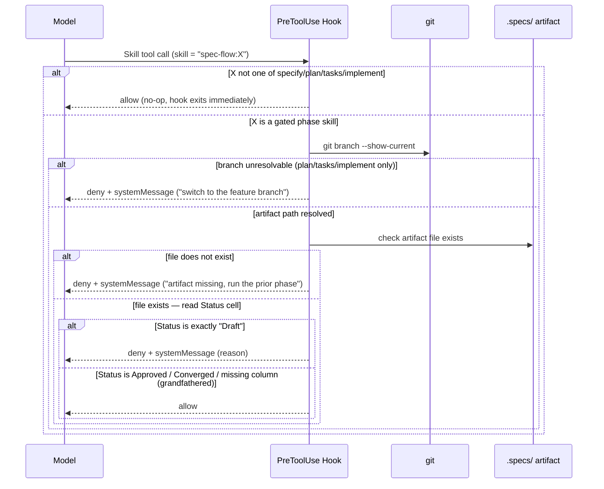

# Plan: Phase Approval Gate

| Name                | Code     | Version | Date       | Status   |
| -------------------- | -------- | ------- | ---------- | -------- |
| phase-approval-gate  | PLAN-003 | R02     | 2026-07-17 | Approved |

## Approach

A command-type `PreToolUse` hook (`hooks/hooks.json` + `hooks/check-phase-approval.sh`) intercepts every `Skill` tool call, filters to the four gated phase skills, resolves the prior artifact for that transition from the current git branch name, and denies the call in two situations: (a) the artifact's `Status` cell is exactly `Draft`, or (b) no artifact can be resolved at all (no git branch, no `.specs/<branch>/`, or the specific file doesn't exist yet). Only one case allows despite uncertainty — an *existing* artifact with no `Status` column (a pre-this-feature format, grandfathered). Every other resolvable case (`Approved`, `Converged`, any other value) allows normally. This hook reinforces the existing prose `<HARD-GATE>`, it does not replace it.

US2 (record approval as part of the existing confirm step) needs no new architecture — it's satisfied by editing each phase's own `SKILL.md` (the "on approval"/"on revision" steps), which was already done this session, before this feature's formal `plan`/`tasks` phases. This plan's Architecture and File Structure sections below cover only US1's hook mechanism.

## Constitution Check

- **Tech Stack**: Aligned — a bash script and a JSON config file, no new language or runtime.
- **Code Principles**: This feature *is* the R02/R03 narrow hooks exception — a native Claude Code hook enforcing the plugin's own approval gate, not a general extensions framework. Hard gates elsewhere stay prose-only.
- **Security**: N/A — the hook makes no git operations and writes no files; nothing here touches destructive-git-op or secrets-in-`.specs` concerns.
- **Operational Principles**: N/A — doesn't touch the release/version-bump process.
- **Observability**: N/A — not `analyze`/`converge` output.
- **Performance**: N/A — not about model/effort assignment.
- **Dependency Policy**: MUST satisfied — uses only bash/git/grep/sed, all already required by the plugin. Deliberately does **not** add `jq` (see Dependencies below).
- **Constraints**: Satisfied — no network call, self-contained, portable to any POSIX-ish shell with grep/sed.

## NFR Compliance

- **MUST** native hook, no external service/network: satisfied — command-type hook, pure bash/grep/sed, no network calls of any kind.
- **MUST** clear reason on block: satisfied — the `systemMessage` field carries a human-readable reason, e.g. `".specs/003-phase-approval-gate/tasks.md" Status is Draft — ask the user to approve it before running spec-flow:implement.`
- **SHOULD** fast check: satisfied — one `git branch --show-current`, one file read, one grep/sed extraction; no loops, no network, no semantic judgment.

## Architecture

The hook sits between the model's attempt to invoke a gated phase skill and the skill actually running. It never touches conversation content — only a git branch name and one table cell.

<!-- Include a Mermaid diagram when more than one component/interaction is involved — flowchart for structure, sequenceDiagram for request/data flow. Skip the fence for a single-file, single-responsibility change; a diagram of one box adds nothing. -->



## File Structure

```text
hooks/
├── hooks.json                  ← new: registers the PreToolUse hook, matcher "Skill"
└── check-phase-approval.sh     ← new: resolves the prior artifact, reads its Status, emits allow/deny
```

## Data Model

N/A — no data model. The hook only reads one table cell from an existing markdown file; it introduces no new entities.

## API / Interface Contracts

**Hook input** (stdin, from Claude Code, per `PreToolUse`'s documented shape):

```json
{"tool_name": "Skill", "tool_input": {"skill": "spec-flow:plan", "args": "..."}}
```

**Hook output** (stdout, exit 0) — `hookEventName` is required inside `hookSpecificOutput`; Claude Code silently discards the whole output as invalid without it, which falls through to allowing the call regardless of `permissionDecision` (confirmed via real `claude --debug` testing, see Risks & Unknowns):

```json
{"hookSpecificOutput": {"hookEventName": "PreToolUse", "permissionDecision": "deny"}, "systemMessage": "<reason>"}
```

or, when allowed:

```json
{"hookSpecificOutput": {"hookEventName": "PreToolUse", "permissionDecision": "allow"}}
```

**Gated skill → prior artifact mapping**:

| Gated skill | Prior artifact |
|---|---|
| `spec-flow:specify` | `.specs/constitution.md` |
| `spec-flow:plan` | `.specs/<branch-name>/spec.md` |
| `spec-flow:tasks` | `.specs/<branch-name>/plan.md` |
| `spec-flow:implement` | `.specs/<branch-name>/tasks.md` |

`<branch-name>` = `git branch --show-current` — assumed equal to the feature directory name, per the naming convention `specify/SKILL.md` already enforces (it refuses to write `spec.md` until a matching feature branch is checked out).

**Deny reasons** (three distinct `systemMessage` templates):
- Branch unresolvable: `"Can't determine the current feature (no git branch) — make sure you're on a feature branch before running <skill>."`
- Artifact file missing: `"<artifact> doesn't exist — make sure you're on the correct feature branch and that the prior phase has completed."`
- `Status: Draft`: `"<artifact> has Status: Draft — ask the user to approve it before running <skill>."`

## Dependencies

None — existing dependencies suffice (bash, git, grep, sed). Deliberately does not add `jq`, even though `plugin-dev:hook-development`'s own examples use it for hook scripts — the two fields this hook needs (`tool_name`, and the invoked skill's name) are flat strings inside a shallow JSON object, extractable with `sed`/`grep` without a JSON parser. Adding `jq` would be a new external-binary dependency for a project whose constitution prefers small, single-purpose bash helpers over reaching for a new tool.

## Risks & Unknowns

- ~~The exact `tool_input` key holding the invoked skill's name~~ — **Resolved 2026-07-17** via real `claude --debug` testing: `tool_name` is literally `"Skill"`, and `tool_input.skill` holds the invoked skill's name (e.g. `"spec-flow:specify"`), exactly as assumed. No change needed to the extraction pattern.
- **Found via the same `claude --debug` session, not anticipated in the original plan**: the hook's output JSON was missing the `hookEventName` field inside `hookSpecificOutput`, which Claude Code requires — without it, the entire output fails schema validation and the call is allowed regardless of the computed `permissionDecision`. The `deny` decision was being computed correctly (confirmed in the debug log, `systemMessage` and all) but silently discarded. Fixed by adding `"hookEventName": "PreToolUse"` to both JSON emissions in `check-phase-approval.sh`; re-verified via the same real-environment path (`Status: Draft` on a live artifact → confirmed `deny`, restored to `Approved` → confirmed `allow`). This is exactly the class of bug that only running the code (not tracing it) surfaces — see backlog `B007`.
- Note for future debugging: the debug log's repeated `"Hooks: Found 0 total hooks in registry"` line is unrelated internal logging (appears for non-hook tool calls too) — it does not indicate this hook failed to load.
- Hooks load only at Claude Code session start — a session already running when this feature ships won't pick up the new hook until restarted. Not a blocker, but worth surfacing in the after-implement summary so a still-running session isn't mistaken for a broken hook.
- Fail-open is now narrow, not blanket: only an *existing* artifact with no `Status` column (grandfathered, pre-this-feature format) allows despite uncertainty. A missing branch, a missing `.specs/<branch>/` directory, or a missing artifact file all deny instead — this was refined after the user asked, while testing on `main`, whether the hook protects anything there (it didn't, under the original blanket-fail-open design; `spec.md`'s Clarifications documents the decision to tighten it).
