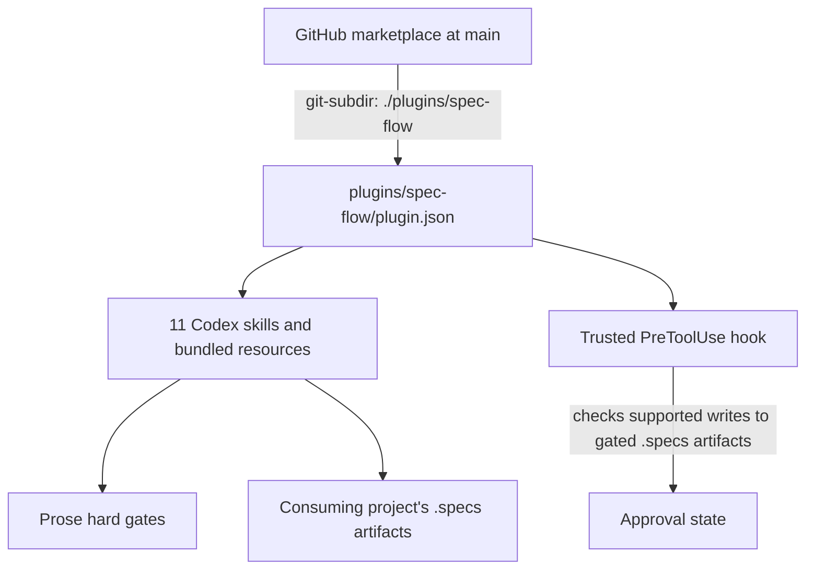

# Plan: Codex Plugin Migration

| Name                  | Code     | Version | Date       | Status |
| --------------------- | -------- | ------- | ---------- | ------ |
| codex-plugin-migration | PLAN-006 | R01     | 2026-09-12 | Approved |

## Approach

Move the plugin payload into `plugins/spec-flow/` and package it with the portable Agent Plugins root `plugin.json`; expose that package through `.agents/plugins/marketplace.json`. The marketplace entry retrieves the package from this repository's GitHub URL using `git-subdir`, path `./plugins/spec-flow`, and ref `main`. Convert skill activation and documentation to Codex conventions, retain each prose hard gate, and adapt the approval hook to Codex `PreToolUse` as a supplementary guard for supported artifact writes. Amend the dogfooding constitution and maintainer guidance so they describe the resulting Codex package and its trust limits.

## Constitution Check

- **Tech Stack**: Replace the Claude plugin runtime and `.claude-plugin` manifests with the portable Agent Plugins package format. Keep Markdown skills, templates, and existing shell helpers; use Python's standard library to parse Codex hook JSON reliably, without third-party packages or services.
- **Code Principles**: Preserve one `SKILL.md` per skill and all seven hard gates in skill prose. The Codex hook will supplement the gates by checking approval before supported local writes to gated `.specs` artifacts; it will not claim to intercept skill selection or every possible write path. This retains the constitution's narrow approval-hook exception and rejects a general hooks framework.
- **Security**: Retain the existing Git-destructive-action and no-secrets rules. Document that plugin hooks do not run until the user trusts their definitions and are a guardrail rather than a complete security boundary.
- **Operational Principles**: Keep the current plugin version `0.9.0` during migration and add an `## Unreleased` work-in-progress changelog section with the migration entry. Do not combine the runtime migration with a release-version bump; preserve the separate release commit rule.
- **Observability**: Preserve severity labels and concrete recommendations in `analyze` and `converge` reports.
- **Performance**: Remove Claude-only `model` and `effort` fields from skill frontmatter and replace the constitution's `CLAUDE.md` model-allocation rules with Codex-compatible guidance. Skill metadata keeps the Codex-required `name` and `description`; model selection remains a Codex session setting.
- **Dependency Policy**: Add no package dependency, MCP server, runtime network call, or hosted runtime. GitHub is used only as the source for marketplace and package retrieval/update. The hook uses Python 3 standard-library JSON parsing alongside the existing Bash-based helpers.
- **Constraints**: Keep consuming-project artifacts under `.specs/`, preserve the seven-phase chain and optional side-channel skills, and remove Claude Code as a supported host. Update the constitution from R03 to R04 as an explicit approval checkpoint before implementing the package migration; after that amendment, no current MUST conflicts remain.

## NFR Compliance

- **Portable Agent Plugins package**: Add `plugins/spec-flow/plugin.json` at the package root and place OpenAI-specific hook configuration under `extensions.com.openai`.
- **Codex skill metadata**: Keep `name` and `description` in every `SKILL.md`, remove Claude-specific model/effort metadata, and validate that Codex discovers all 11 skills from the package's `skills/` directory.
- **Workflow and artifact parity**: Preserve the seven gated phases, the optional `clarify` and `analyze` skills, the `.specs/` layouts, and approval-state behavior; update invocation examples to the skill names Codex exposes.
- **GitHub repository marketplace**: Add `.agents/plugins/marketplace.json` with plugin `spec-flow`, source type `git-subdir`, repository URL `https://github.com/santiago-migoni/spec-flow.git`, package path `./plugins/spec-flow`, ref `main`, and the required availability, authentication, and category metadata. Document adding `santiago-migoni/spec-flow` as a marketplace and installing the plugin from it; do not use a local checkout in the installation flow.
- **Codex repository guidance**: Update `README.md`, `AGENTS.md`, and `.specs/constitution.md` together so they describe the same host, package, skills, hook, marketplace, and release paths.
- **Skills-only package**: Keep the package free of MCP servers, custom UI, runtime network dependencies, and external runtime services; GitHub is used for package retrieval and updates only.
- **Hook portability and scope**: Use `PLUGIN_ROOT` and Codex's `PreToolUse` input/output schema; match supported local file-writing tools for gated `.specs` artifact writes. Document that hooks require user trust and do not replace skill hard gates.

## Architecture

The GitHub marketplace at `main` points to the package folder with `git-subdir`, and Codex loads the portable manifest, skills, and bundled resources from that package. Skills remain responsible for the workflow and hard gates. A trusted `PreToolUse` hook checks approval for supported writes to gated `.specs` artifacts; it does not gate skill selection or claim coverage of arbitrary shell or specialized write paths.



## File Structure

```text
.agents/plugins/marketplace.json              ← new: GitHub-backed marketplace catalog for spec-flow
AGENTS.md                                      ← modified: correct package, skill, hook, marketplace, and release guidance
CHANGELOG.md                                   ← modified: add an `## Unreleased` section and migration entry
CLAUDE.md                                      ← deleted: remove Claude Code-only maintainer guidance
README.md                                      ← modified: describe Codex installation, activation, and marketplace use
.claude-plugin/marketplace.json                ← deleted: remove Claude marketplace listing
.claude-plugin/plugin.json                    ← deleted: remove Claude plugin manifest
hooks/check-phase-approval.sh                 ← deleted: replace Claude hook implementation with Codex event handling
.specs/constitution.md                        ← modified: propose R04 Codex runtime and hook guidance for user approval
plugins/spec-flow/plugin.json                 ← new: portable Agent Plugins manifest at package root
plugins/spec-flow/hooks/hooks.json            ← moved and modified: Codex PreToolUse registration
plugins/spec-flow/hooks/check-phase-approval.py ← new: parse Codex hook input and check gated artifact writes
plugins/spec-flow/scripts/check-complete.sh   ← moved: retain the task completion helper
plugins/spec-flow/skills/analyze/SKILL.md     ← moved and modified: Codex metadata, activation language, and paths
plugins/spec-flow/skills/analyze/assets/report-template.md ← moved and modified: Codex activation language
plugins/spec-flow/skills/backlog/SKILL.md     ← moved and modified: Codex metadata, activation language, and paths
plugins/spec-flow/skills/backlog/assets/backlog-template.md ← moved and modified: Codex activation language
plugins/spec-flow/skills/clarify/SKILL.md     ← moved and modified: Codex metadata, activation language, and paths
plugins/spec-flow/skills/clarify/assets/clarifications-template.md ← moved and modified: Codex activation language
plugins/spec-flow/skills/constitution/SKILL.md ← moved and modified: Codex metadata, activation language, and project exploration paths
plugins/spec-flow/skills/constitution/assets/constitution-template.md ← moved: retain the constitution output template
plugins/spec-flow/skills/converge/SKILL.md    ← moved and modified: Codex metadata and activation language
plugins/spec-flow/skills/converge/assets/convergence-report-template.md ← moved: retain the convergence report template
plugins/spec-flow/skills/finishing-branch/SKILL.md ← moved and modified: Codex metadata and version-file examples
plugins/spec-flow/skills/implement/SKILL.md   ← moved and modified: Codex metadata and activation language
plugins/spec-flow/skills/plan/SKILL.md        ← moved and modified: Codex metadata and activation language
plugins/spec-flow/skills/plan/assets/plan-template.md ← moved: retain the plan output template
plugins/spec-flow/skills/specify/SKILL.md     ← moved and modified: Codex metadata, activation language, and helper path
plugins/spec-flow/skills/specify/assets/spec-template.md ← moved and modified: Codex activation language
plugins/spec-flow/skills/specify/scripts/next-feature-number.sh ← moved: retain the feature-number helper
plugins/spec-flow/skills/tasks/SKILL.md       ← moved and modified: Codex metadata and activation language
plugins/spec-flow/skills/tasks/assets/tasks-template.md ← moved: retain the task output template
plugins/spec-flow/skills/using-spec-flow/SKILL.md ← moved and modified: Codex skill names and invocation examples
```

## Data Model

N/A — the change reorganizes plugin files and adds JSON manifests; consuming-project artifact formats remain unchanged.

## API / Interface Contracts

- Portable package manifest: root `plugin.json` with the Agent Plugins 1.0 schema, package identity and version, and `extensions.com.openai.hooks` pointing to `./hooks/hooks.json`.
- GitHub repository marketplace: top-level `name: "spec-flow-repo"` and `interface.displayName`; one `plugins[]` entry named `spec-flow` whose `source` is `{ "source": "git-subdir", "url": "https://github.com/santiago-migoni/spec-flow.git", "path": "./plugins/spec-flow", "ref": "main" }`, with `policy.installation: "AVAILABLE"`, `policy.authentication: "ON_INSTALL"`, and `category: "Productivity"`. Document `codex plugin marketplace add santiago-migoni/spec-flow --ref main` followed by `codex plugin add spec-flow@spec-flow-repo`; both commands retrieve the marketplace and package through GitHub, without a local checkout.
- Hook: Codex `PreToolUse` matcher for `apply_patch`, `Edit`, and `Write`; consume Codex's JSON event on stdin, use `PLUGIN_ROOT` for bundled files, and return the documented `hookSpecificOutput.permissionDecision` response when denying a gated artifact write. For supported writes to `spec.md`, `plan.md`, and `tasks.md`, deny when the preceding artifact is missing or `Draft`; keep the current behavior for other existing statuses and for grandfathered artifacts without a `Status` column.
- Skill invocation: README and skills use `$<skill-name>` (or the exact selector Codex reports during package validation), never Claude slash commands.

## Dependencies

No third-party packages, MCP services, or runtime network services. GitHub access is required only when Codex retrieves or updates the marketplace and package. The hook requires Python 3 for standard-library JSON parsing; the remaining helpers continue to use the existing Bash environment.

## Risks & Unknowns

- Plugin hook trust is a user decision and hooks cover only supported local file-write paths. Keep every prose hard gate and state this limitation in the installation guidance.
- The GitHub marketplace and package source must remain reachable at the documented repository and `main` ref. Validate the source declaration and CLI commands; an end-to-end installation of the migrated package from GitHub requires the change to be available on that remote ref.
- Codex may expose plugin skills with a namespace in the selector. Confirm the exact names in a disposable local Codex install and use those names consistently in README and skill references.
- Python 3 may not be available in every environment where the plugin is installed. Validate the hook on the supported development platforms and report clearly if its interpreter is unavailable; skill discovery and prose gates must still work.
