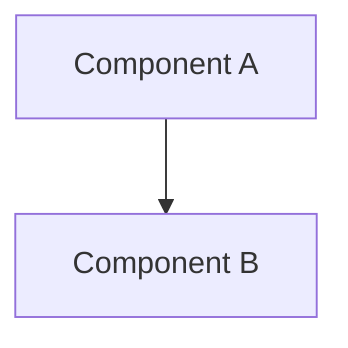

# Plan: [Feature Name]

| Name   | Version              | Date         |
| ---    | ---                  | ---          |
| [name] | [R00, R01, R02, ...] | [YYYY-MM-DD] |

## Approach

[2-3 sentences: the chosen implementation strategy and why]

## Constitution Check

<!-- One line per constitution section that applies. For principle sections (Code Principles, Security, Operational Principles, Observability, Performance, Dependency Policy), name any MUST this plan cannot satisfy (blocking — resolve before writing tasks) and any SHOULD it deviates from (state the reason here). Write "N/A" for a section genuinely irrelevant to this feature. -->

- **Tech Stack**: [Confirm alignment with constitution or flag conflict]
- **Code Principles**: [Relevant MUST/SHOULD and how this plan satisfies it, or "N/A"]
- **Security**: [Relevant MUST/SHOULD and how this plan satisfies it, or "N/A"]
- **Operational Principles**: [Relevant MUST/SHOULD and how this plan satisfies it, or "N/A"]
- **Observability**: [Relevant MUST/SHOULD and how this plan satisfies it, or "N/A"]
- **Performance**: [Relevant MUST/SHOULD and how this plan satisfies it, or "N/A"]
- **Dependency Policy**: [Relevant MUST/SHOULD and how this plan satisfies it, or "N/A"]
- **Constraints**: [Any constitution constraint that shapes this plan]

## NFR Compliance

<!-- One line per Non-Functional Requirement in spec.md — how the architecture satisfies it, or flag it as unaddressed. Write "N/A" if spec.md's Non-Functional Requirements section is "N/A". -->

- [NFR from spec.md]: [How this plan satisfies it, or flag as unaddressed]

## Architecture

[Describe the architecture. Keep it to what matters for this feature — don't redesign the whole system.]

<!-- Include a Mermaid diagram when more than one component/interaction is involved — flowchart for structure, sequenceDiagram for request/data flow. Skip the fence for a single-file, single-responsibility change; a diagram of one box adds nothing. -->



## File Structure

<!-- Exact paths of every file this feature creates or modifies — no placeholders, no "etc." -->

```text
src/
├── new-file.ts          ← new: [what it contains]
└── modified-file.ts     ← modified: [what changes]
```

## Data Model

[If applicable: entities, fields, relationships. If not applicable, write "N/A".]

## API / Interface Contracts

[If applicable: function signatures, endpoint contracts, CLI interface. If not applicable, write "N/A".]

## Dependencies

[New packages or tools required. If none, write "None — existing dependencies suffice".]

## Risks & Unknowns

- [Risk 1 and mitigation]
- [NEEDS CLARIFICATION: anything that can't be decided until implementation starts]
